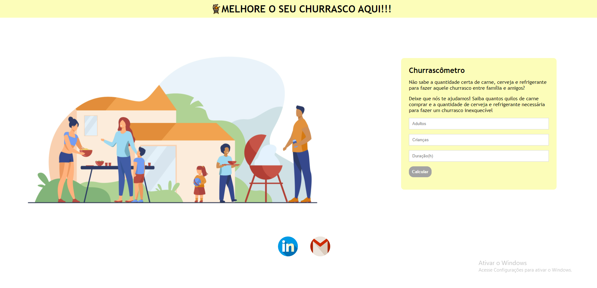
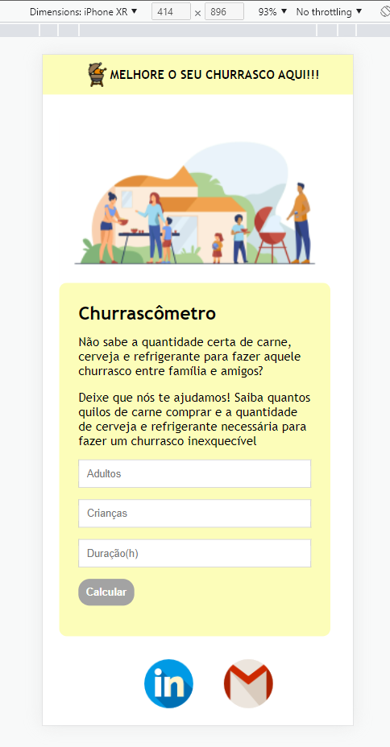
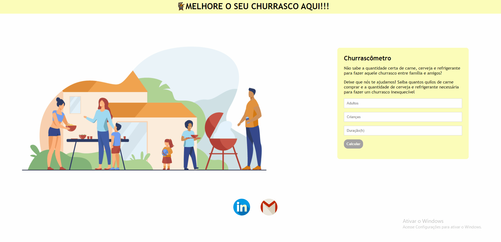

<h1>Churrascômetro</h1>

<!-- LINKS -->

 
 <h2> Sumário</h2>
 
 <a href="#fotos">Fotos</a> - 
  <a href="#GIFs">GIFs</a> - 
  <a href="#sobre">Sobre o Projeto</a> - 
  <a href="#tec">Tecnologias</a>

 

<!-- FOTOS -->

    <h2> 📸 Fotos </h2>
        
          
       
 <h2> 📱 Responsivo </h2>
    
          
        
   <h2 id="GIFs"> 🎥 GIFs </h2>
        
          
  

<!-- SOBRE -->

    <h2> 📝 Sobre o Projeto </h2> 
    
 Esse projeto fará com que você e sua família tenham um churrasco com a quandtidade certa de carne e bebida. Ele leva em conta que um adulto consuma em média 400g de carne e beba 1,3 Litros de cerveja; leva em conta que uma criança consuma cerca de 200g de carne e 600ml de refrigerante; além disso, caso a duração do churrasco seja maior do que 5 horas, os valores irão aumentar automaticamente, no final da conta, os valores são arredondados para o valor mais alto

 
 <h3 align="center">Link do Projeto <a href="https://lucasfrancobn.github.io/Churrascometro/">CLIQUE AQUI</a></h3>

 

<!-- TECNOLOGIAS -->

<h2> 🖥️ Tecnologias</h2>
    
 ✔️ HTML 5 

    
 ✔️ CSS 3 

    
 ✔️ JavaScript 

